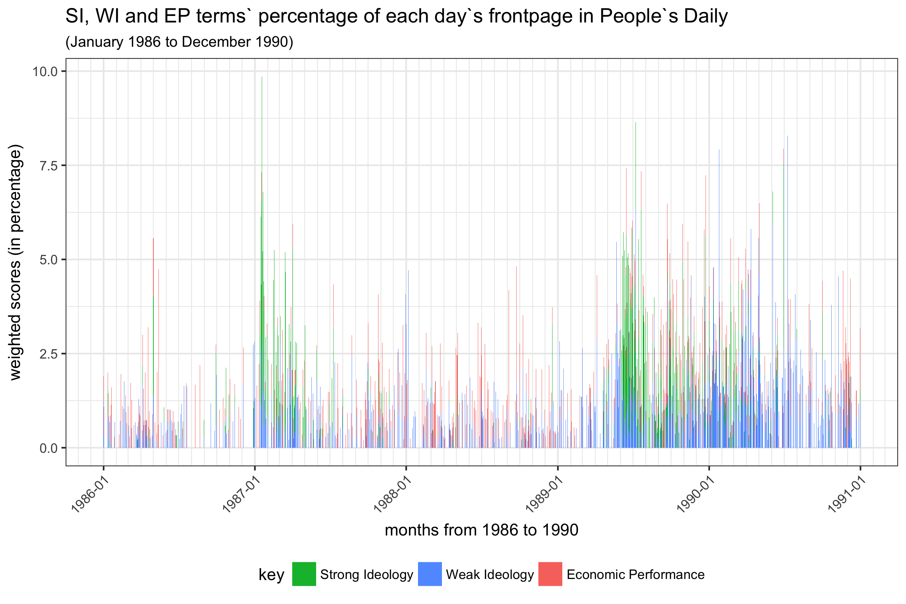

# Introduction
For most of its issues in 1902, the *Ellensburg [Washington] Dawn* featured a quotation from Benjamin Franklin prominently on its front page. "A Bible and a newspaper in every house," the masthead proclaimed, "are the principal support of virtue, morality, and civil liberty."^[*Ellensburg Dawn* (Ellensburg, Wash.), [18 Jan. 1902](http://chroniclingamerica.loc.gov/lccn/sn88085012/1902-01-18/ed-1/seq-1/). America’s Public Bible brings together two strands of scholarship. On the one hand, its methodology is drawn from recent digital humanities projects which are concerned with tracking the reuse of texts. On the other hand, it draws on a deep scholarly literature on the Bible as a cultural text in American life. The Bible included tens of thousands of texts, each of which could be interpreted in many ways. The contribution this site makes is to show how thousands of biblical verses were used over nearly a century in some 56 billion words of text, revealing trends that are inaccessible to a single scholar’s reading of these documents, yet enabling a close reading of the ways in which verses were put to use.For many Americans the Bible was a text whose meaning was self-evident, yet the Bible’s role in U.S. history cannot be understood apart from the ways that Americans
 

# Descritption of data
 
For most of its issues in 1902, the *Ellensburg [Washington] Dawn* featured a quotation from Benjamin Franklin prominently on its front page. "A Bible and a newspaper in every house," the masthead proclaimed, "are the principal support of virtue, morality, and civil liberty."^[*Ellensburg Dawn* (Ellensburg, Wash.), [18 Jan. 1902](http://chroniclingamerica.loc.gov/lccn/sn88085012/1902-01-18/ed-1/seq-1/). 